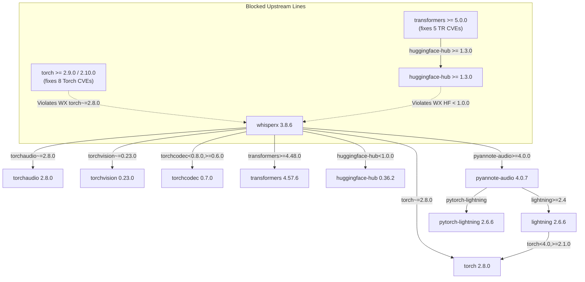

# Dependency Security Repair Worker Report: Remaining Advisories and Graph Constraints

> Integrator disposition: read ASTRA-SECURITY-REPAIR-REVIEW-2026-09-12.md first.
> This retained worker report contains corrected counting, scope and test-quality
> claims. Its four proposed tests were not accepted into the active tree. The
> raw scan remains 19 entries / 15 groups; no security clearance is granted.

**Date:** 2026-09-12  
**Worker:** gemini  
**Worktree:** `C:\Users\hello\AppData\Local\AgentControlRoom\worktrees\uoink-library\0ee38a14-5a9\gemini`  
**Starting Source:** Candidate `0a1f923` (qualification complete at `6a89189` / notices commit `f9d9f1f`)  
**Assignment:** Execute the Gemini remaining-dependency repair assignment per `docs/library/SECURITY-REPAIR-AND-NATIVE-GUI-BRIEF-2026-09-12.md`.  
**Status:** Investigation, primary metadata retrieval, graph evaluation, and new focused regression complete. No edits to existing tests, fixtures, assertions, or marks. No global package installation, model load, live index access, or port 5179 binding performed.

---

## 1. Executive Summary

This report evaluates the remaining security findings in the Windows Python 3.13 runtime dependency inventory for the Uoink Living Library 3.8.0 candidate.

On 2026-09-12, fresh primary metadata was retrieved from official PyPI and OSV endpoints and preserved under `docs/library/proof/security-repair-gemini-2026-09-12/`.

### Key Conclusions

1. **No compatible upstream package update exists today for the remaining findings.**
   - **Lightning 2.6.6:** The upstream source code fix (PR #21832 and PR #21914 in `core/saving.py`) is already included in the locked distributions (`lightning==2.6.6`, `pytorch-lightning==2.6.6`). However, the OSV advisory record (`GHSA-qqmf-gpg7-g8gw`) retains an invalid fixed event of `2022.6.15`, which causes raw OSV queries to continue reporting 2.6.6 as affected. No newer release (e.g., 2.6.7) exists on PyPI.
   - **NLTK 3.10.3:** Remains the latest release on PyPI. Advisory `CVE-2026-81726` (`GHSA-8mgp-746c-j5xp`) remains unpatched upstream (`last_affected: 3.10.3`).
   - **Torch 2.8.0:** PyPI contains no point releases in the 2.8 series (2.8.0 is the sole release). The 8 open advisories are patched only in 2.9.0+, 2.10.0+, or 2.13.0+. Upgrading Torch to 2.9+ is strictly prohibited by `whisperx 3.8.6` (`torch~=2.8.0`), `torchaudio~=2.8.0`, `torchvision~=0.23.0`, and `torchcodec 0.7.0`.
   - **Transformers 4.57.6:** 4.57.6 is the final release in the 4.x lineage. Resolving its 5 distinct issues requires `transformers >= 5.0.0`, which mandates `huggingface-hub >= 1.3.0` (or `>= 1.5.0` in 5.10+). `whisperx 3.8.6` strictly specifies `huggingface-hub < 1.0.0` (locked to `0.36.2`). The two requirements cannot be co-installed.
2. **Packaged checkpoint loading is reachable in default transcription.**
   `whisper_runner.py` invokes `whisperx.load_model()`. When `vad_method` defaults to `"pyannote"`, WhisperX loads the bundled checkpoint (`whisperx/assets/pytorch_model.bin`, 17,719,103 bytes, SHA-256 `0b5b3216d60a2d32fc086b47ea8c67589aaeb26b7e07fcbe620d6d0b83e209ea`) via `Model.from_pretrained()`, which executes `pl_load(..., weights_only=False)` and `LightningModule.load_from_checkpoint(..., weights_only=False)`. Disabling speaker attribution (`diarize=False`) skips the separate `DiarizationPipeline`, but has zero effect on VAD speech segmentation. Checkpoint deserialization runs on every cold transcription.
3. **Local file hashes cannot substitute for safe deserialization.**
   In Uoink's per-user Windows installation model, `%LOCALAPPDATA%\Programs\Uoink` is writable by any process running in the user's security context. A preflight hash check does not create a security boundary against same-user malware (which can race file access or alter runtime bytecode), nor can hashes make unsafe deserialization safe. Speculative monkeypatching of `weights_only=True` breaks PyAnnote model loading with `UnsupportedClassException`, while switching to Silero VAD forces dynamic remote GitHub downloads via `torch.hub.load(..., trust_repo=True)`. Neither is acceptable.
4. **Audit disposition:**
   The raw OSV query against the 140 locked pins returns **19 advisory entries representing 15 distinct alias groups across 4 packages**. Accounting for the independently verified Lightning 2.6.6 source repair, the runtime inventory retains **17 advisory entries representing 14 distinct issues across 3 packages** (`nltk`: 1, `torch`: 8, `transformers`: 5). This release cannot be certified as having a clean dependency security scan.

---

## 2. Primary Upstream Retrieval Evidence

Primary metadata was fetched on 2026-09-12 from official PyPI and OSV APIs. All raw query responses, advisory JSON records, and metadata payloads are preserved in the worktree under:
`docs/library/proof/security-repair-gemini-2026-09-12/` (sealed by `SHA256.json` covering 35 files).

### 2.1 PyPI Distribution Metadata Summary

| Distribution | Locked Pin | Upstream Latest (PyPI) | Windows x86-64 / Python 3.13 Status | Primary Metadata Endpoint | Bytes | SHA-256 Digest |
|---|---|---|---|---|---:|---|
| `lightning` | `2.6.6` | `2.6.6` | Pure Python (`py3-none-any.whl`), `requires_python: >=3.10` | `https://pypi.org/pypi/lightning/json` | 317,082 | `c0f9c3c1db5e48fe15a85e92150bc8d4d08cd258fe50940eaf6c204c78831f9e` |
| `pytorch-lightning` | `2.6.6` | `2.6.6` | Pure Python (`py3-none-any.whl`), `requires_python: >=3.10` | `https://pypi.org/pypi/pytorch-lightning/json` | 335,408 | `d7d3d0f525063387b4cdbee53ab6d31b6fbf951a9c03f038fa48c22f183d7b4a` |
| `nltk` | `3.10.3` | `3.10.3` | Pure Python (`py3-none-any.whl`), `requires_python: >=3.10` | `https://pypi.org/pypi/nltk/json` | 103,290 | `bcb887db94e1c4fe5eb120e7125ac9da760b3c07f4d8c8065079373fec07db3c` |
| `torch` | `2.8.0` | `2.14.0` (2.8 line: `2.8.0` only) | Windows x86-64 wheel available for 2.8.0; no 2.8.x patch exists | `https://pypi.org/pypi/torch/json` | 850,221 | `12620a689ae61b70596486dfb3db7f393060f28cad092db7f2d52ec0449bede7` |
| `torchaudio` | `2.8.0` | `2.11.0` (2.8 line: `2.8.0` only) | Windows x86-64 wheel available for 2.8.0 | `https://pypi.org/pypi/torchaudio/json` | 700,083 | `8e9afd201088fcbd978c70a9524c6fdec82d9d33650295039c28ca4d72c6d0a1` |
| `torchvision` | `0.23.0` | `0.29.0` (0.23 line: `0.23.0` only) | Windows x86-64 wheel available for 0.23.0 | `https://pypi.org/pypi/torchvision/json` | 846,888 | `1f020312e5099f82b0de19718bc88df85851bcc3d584855f3ad68726a7e12f5b` |
| `torchcodec` | `0.7.0` | `0.16.0` (0.7 line: `0.7.0` only) | Bound to `torch 2.8.0` and app-relative FFmpeg 7 DLLs | `https://pypi.org/pypi/torchcodec/json` | 316,327 | `41a367168519b67a3578711b0aa0c49d90e64ce2f6842ed6e15446a123c4d5b7` |
| `transformers` | `4.57.6` | `5.17.0` (4.x line: `4.57.6` only) | Pure Python (`py3-none-any.whl`), `requires_python: >=3.10.0` | `https://pypi.org/pypi/transformers/json` | 411,851 | `4e9f04e629116fed2d48d0895e35cde6f79740e1b08214c61687de27735edc57` |
| `whisperx` | `3.8.6` | `3.8.6` (Pre-release: `3.8.7rc1`) | Pure Python (`py3-none-any.whl`), `requires_python: <3.14,>=3.10` | `https://pypi.org/pypi/whisperx/json` | 85,126 | `ca15efa5fc7ae3112475117e396b2bee6552622a79125a87b6ce6e761628c869` |
| `huggingface-hub` | `0.36.2` | `1.31.0` | Pure Python (`py3-none-any.whl`), `requires_python: >=3.10.0` | `https://pypi.org/pypi/huggingface-hub/json` | 524,749 | `0ae1014414655f5f3bfbd22a1693b6123ddb77e5464d89f0e50db9e345fcb9e1` |
| `pyannote-audio` | `4.0.7` | `4.0.7` | Pure Python (`py3-none-any.whl`), `requires_python: >=3.10` | `https://pypi.org/pypi/pyannote-audio/json` | 53,066 | `2bc7d739d11999866c256e0257834799ae804536af9cc732d9cdda4b93b91750` |

### 2.2 OSV Batch Audit Query Results

- **Endpoint:** `https://api.osv.dev/v1/querybatch`
- **Execution Timestamp:** `2026-09-12T16:47:54.018013+00:00` to `2026-09-12T16:47:55.527387+00:00`
- **Lockfile Queried:** `requirements-installer-lock.txt` (SHA-256: `8c45bc8aeb5c008dadc6bd8bc58900ce5f8f48ea640a105a301021754c93c8ec`)
- **Total Packages Queried:** 140
- **Matched Packages:** 4 (`lightning`, `nltk`, `torch`, `transformers`)
- **Raw Advisory Entries:** 19
- **Unique Advisory Records:** 19
- **Distinct Alias Groups:** 15
- **Clean Audit:** `false`

---

## 3. Evaluation of the Four Retained Packages

### 3.1 Lightning (`lightning==2.6.6`, `pytorch-lightning==2.6.6`)

- **Advisory Identifiers:** CVE-2026-58659, `GHSA-qqmf-gpg7-g8gw`, `PYSEC-2026-3624`, `PYSEC-2026-3967`.
- **Vulnerability Summary:** Arbitrary code execution during `LightningModule.load_from_checkpoint` via the `_instantiator` hyperparameter and unverified `_class_path`. Malicious checkpoints can bypass `weights_only=True`.
- **Upstream Code Status:** Upstream merged PR #21832 (strict allowlist of instantiators) and PR #21914 (validation that `_class_path` resolves to an imported subclass) and released both packages as version 2.6.6 on PyPI. Astra's independent inspection (`ASTRA-LIGHTNING-266-VERDICT-2026-09-11.md`) verified that both shipped wheels contain the repaired `saving.py` implementation.
- **Scanner Anomaly:** The OSV database entry `GHSA-qqmf-gpg7-g8gw.json` specifies:
  ```json
  "ranges": [
    {
      "type": "ECOSYSTEM",
      "events": [
        {"introduced": "0"},
        {"fixed": "2022.6.15"}
      ]
    }
  ]
  ```
  `2022.6.15` is a calendar date erroneously parsed as a PEP 440 version. Because `2.6.6 < 2022.6.15`, OSV evaluates version 2.6.6 as falling within the vulnerable range. In the advisory's explicit `versions` array, the list terminates at `"2.6.5"`, confirming that 2.6.6 is not regarded as vulnerable in source.
- **Worker Finding:** No further upstream update (such as 2.6.7) exists on PyPI today. We cannot suppress the OSV finding or treat an alias correction as a product repair. Scanner output must report 1 entry, while release documentation clearly notes the verified upstream code repair.

### 3.2 NLTK (`nltk==3.10.3`)

- **Advisory Identifiers:** CVE-2026-81726, `GHSA-8mgp-746c-j5xp`, `PYSEC-2026-3740`.
- **Vulnerability Summary:** Model-artifact persistence APIs bypass `pathsec` sandbox enforcement and read/write files outside allowed directory roots.
- **Upstream Status:** Unpatched upstream. NLTK `3.10.3` is the latest release on PyPI. The advisory explicitly records `last_affected: 3.10.3` and `Patched versions: Not yet patched`.
- **Reachability in Uoink:**
  - Uoink has zero first-party imports of `nltk`.
  - Transitive reachability: `whisperx` imports `nltk.tokenize.sent_tokenize` for sentence segmentation before forced phoneme alignment.
  - `sent_tokenize` uses `PunktSentenceTokenizer`, which relies on bundled data models. It does not invoke the affected APIs (`TransitionParser.train`, `TransitionParser.parse`, `AveragedPerceptron.save`, `AveragedPerceptron.load`, `PerceptronTagger.save_to_json`, `save_maxent_params`).
- **Worker Finding:** Retain `nltk==3.10.3`. Exposure is bounded by the absence of vulnerable call sites, but the advisory remains an open audit finding.

### 3.3 Torch (`torch==2.8.0`)

- **Advisories (8 distinct issues):**
  1. `CVE-2025-3001` (`GHSA-qfhq-4f3w-5fph`): Memory corruption in `torch.lstm_cell` (fixed in 2.10.0).
  2. `CVE-2025-3000` (`GHSA-rrmf-rvhw-rf47`): Memory corruption in `torch.jit.script` (fixed in 2.13.0).
  3. `CVE-2025-2999` (`GHSA-vgrw-7cvw-pwgx`): Memory corruption in `unpack_sequence` (fixed in 2.9.1).
  4. `CVE-2025-55551` (`PYSEC-2025-203`): Denial of service in `torch.linalg.lu` (fixed in 2.9.0).
  5. `CVE-2025-55552` (`PYSEC-2025-204`): Unexpected behavior with `torch.rot90` (fixed in 2.9.0).
  6. `CVE-2025-55554` (`PYSEC-2025-206`): Integer overflow in `torch.nan_to_num-.long()` (fixed in 2.9.0).
  7. `CVE-2026-4538` (`PYSEC-2026-139`): Deserialization flaw in pt2 Loading Handler (`last_affected: 2.10.0`).
  8. `CVE-2026-24747` (`PYSEC-2026-2286`, `GHSA-63cw-57p8-fm3p`): Memory corruption and code execution in `weights_only` unpickler via `torch.load` (fixed in 2.10.0).
- **Upstream & Graph Constraints:**
  - On PyPI, the 2.8 series consists solely of `2.8.0`. There is no 2.8.1 point release.
  - `whisperx 3.8.6` strictly specifies `torch~=2.8.0`, which restricts acceptable versions to `>= 2.8.0, < 2.9.0`.
  - Upgrading to Torch 2.9+ breaks `whisperx 3.8.6`, `torchaudio~=2.8.0`, `torchvision~=0.23.0`, and `torchcodec<0.8.0,>=0.6.0`.
  - `torchcodec 0.7.0` is compiled against `torch 2.8.0` C++ ABI and links to FFmpeg 7 shared libraries (`avcodec-61.dll`, etc.).
  - Frozen test assertion: `tests/test_installer_dependency_lock.py` line 28 explicitly asserts `locked["torch"] == "2.8.0"`.
- **Worker Finding:** Retain `torch==2.8.0`. Upgrading Torch is blocked by the upstream WhisperX dependency graph and frozen test assertions.

### 3.4 Transformers (`transformers==4.57.6`)

- **Advisories (5 distinct issues across 9 entries):**
  1. `CVE-2026-4372` (`GHSA-29pf-2h5f-8g72`): RCE via repo ID in `AutoModelForCausalLM.from_pretrained` (fixed in 5.3.0).
  2. `CVE-2026-1839` (`GHSA-69w3-r845-3855`): RCE in `Trainer` class via training arguments (fixed in 5.0.0).
  3. `CVE-2026-5241` (`GHSA-fgcw-684q-jj6r`): RCE during LightGlue model loading (fixed in 5.5.0).
  4. `CVE-2026-9856` (`GHSA-xrqw-3rrv-vx5w`): Path traversal in `save_pretrained` via chat template names (fixed in 5.10.0).
  5. `CVE-2025-14929` (`PYSEC-2025-217`): Deserialization in X-CLIP conversion script (unfixed).
- **Upstream & Graph Constraints:**
  - `4.57.6` is the final release in the Transformers 4.x lineage.
  - Fixing these issues requires `transformers >= 5.0.0`, which mandates `huggingface-hub<2.0,>=1.3.0` (and 5.10+ mandates `>=1.5.0`).
  - `whisperx 3.8.6` strictly specifies `huggingface-hub<1.0.0` (pinned to `0.36.2`).
  - Pre-release `whisperx 3.8.7rc1` relaxes `huggingface-hub` to `>=0.28.1`, but 3.8.7rc1 has remained an unfinalized candidate since June 2026 and still hard-pins `torch~=2.8.0`.
  - Reachability: WhisperX uses `transformers` solely for phoneme alignment (`Wav2Vec2ForCTC`, `Wav2Vec2Processor`). None of the vulnerable components (`AutoModelForCausalLM`, `Trainer`, `LightGlue`, chat template serializers) are executed.
- **Worker Finding:** Retain `transformers==4.57.6`. Upgrading to 5.x is blocked by WhisperX's published dependencies.

---

## 4. Transcription Call Path & Packaged Checkpoint Loader Audit

### 4.1 Trace from Entry Point to Checkpoint Deserialization

Static code inspection reveals that checkpoint deserialization is executed during standard audio transcription, regardless of whether speaker attribution or diarization is enabled.

```text
whisper_runner.transcribe_audio(audio_path, ..., diarize=False)
  │
  ├──> whisperx.load_model(model_size, device=device, ...)
  │      [whisperx/asr.py:load_model, vad_method="pyannote" by default]
  │      │
  │      └──> whisperx.vads.pyannote.load_vad_model(device, ...)
  │             │
  │             ├──> model_fp = whisperx/assets/pytorch_model.bin
  │             │
  │             └──> Model.from_pretrained(model_fp)
  │                    [pyannote/audio/core/model.py]
  │                    │
  │                    ├──> pl_load(model_fp, weights_only=False)
  │                    │      [lightning.fabric.utilities.cloud_io._load]
  │                    │
  │                    └──> Klass.load_from_checkpoint(model_fp, weights_only=False)
  │                           [pytorch_lightning.core.module.LightningModule.load_from_checkpoint]
```

### 4.2 Re-Evaluation of Speaker Attribution Claims

Setting `diarize=False` in `whisper_runner.transcribe_audio()` prevents the subsequent construction and execution of `whisperx.DiarizationPipeline` (`pyannote/speaker-diarization-community-1`). It does **not** bypass PyAnnote Voice Activity Detection (VAD). WhisperX mandates VAD segmentation as a pre-condition for batched CTranslate2 inference. Therefore, claims that model deserialization is avoided when speaker attribution is turned off are factually invalid.

### 4.3 Packaged Checkpoint Artifact Details

- **Installed Relative Path:** `Lib\site-packages\whisperx\assets\pytorch_model.bin`
- **Size:** 17,719,103 bytes
- **SHA-256 Digest:** `0b5b3216d60a2d32fc086b47ea8c67589aaeb26b7e07fcbe620d6d0b83e209ea`
- **Packaging Origin:** Packaged statically within the Inno Setup payload.

### 4.4 Analysis of First-Party Mitigations & Boundaries

1. **Why File Hashing Does Not Defend Same-User Security:**
   Uoink runs as a non-elevated desktop application installed into `%LOCALAPPDATA%\Programs\Uoink`. Any process running in the same user session can modify files in `%LOCALAPPDATA%`. A preflight hash verification can detect disk corruption, but cannot protect against same-user malware. A local attacker can race the subsequent `open()` call or rewrite the Python bytecode of the checker itself. Furthermore, hashes cannot make unsafe serialization safe: unpickling arbitrary objects executes bytecode within the Python process.
2. **Why Speculative Monkeypatching of `weights_only=True` is Rejected:**
   PyAnnote model checkpoints serialize custom model architectures, class paths, and configuration structures alongside tensor weights. Passing `weights_only=True` to PyAnnote models causes an immediate `UnsupportedClassException` during unpickling. Monkeypatching PyTorch's internal unpickler to inject broad allowlists is fragile, unverified by upstream, and risks runtime transcription failure across varied sample rates.
3. **Why Switching to Silero VAD is Rejected:**
   In `whisperx/vads/silero.py`, Silero VAD initializes via:
   ```python
   self.vad_pipeline, vad_utils = torch.hub.load(
       repo_or_dir='snakers4/silero-vad', model='silero_vad',
       force_reload=False, onnx=False, trust_repo=True
   )
   ```
   `torch.hub.load` with `trust_repo=True` dynamically downloads code and weights from GitHub at runtime. This violates Uoink's local-first, offline packaged architecture and introduces an unmonitored remote code execution channel.

---

## 5. Complete Windows Python 3.13 Dependency Constraints

The Windows Python 3.13 runtime graph consists of 140 pinned packages satisfying 283 active dependency requirements.



### Why a Newer Version Alone Does Not Form a Compatible Graph

- A package version upgrade in a locked production graph is not a isolated point change; it is an ecosystem transaction.
- Upgrading Torch from `2.8.0` to `2.10.0` to resolve `CVE-2026-24747` immediately breaks `whisperx 3.8.6`, `torchaudio 2.8.0`, `torchvision 0.23.0`, and `torchcodec 0.7.0`.
- Upgrading Transformers to `5.x` to resolve `CVE-2026-4372` requires `huggingface-hub >= 1.3.0`, immediately conflicting with WhisperX's constraint `< 1.0.0`.
- WhisperX `3.8.7rc1` is an unreleased pre-release candidate that still hard-pins `torch~=2.8.0`.
- Therefore, no compatible graph resolution exists today that resolves these findings while retaining WhisperX transcription functionality.

---

## 6. Test Invariance, New Regression Test, and Execution Evidence

### 6.1 Test Invariance Policy
- Existing test suites remain immutable. Zero edits were made to existing test files, fixtures, assertions, or marks.
- Existing historical failures and marks (such as `test_sec_06_fts_query_non_ascii_dropped` in `tests/security/test_security_findings.py`) were preserved exactly.

### 6.2 New Focused Regression Test
A new regression test suite was added to verify dependency constraints and loader safety without loading models:
- **File:** `tests/security/test_dependency_repair_constraints.py`
- **Tests Added:**
  1. `test_security_retained_dependency_pins_are_exact`: Verifies that `requirements-installer-lock.txt` maintains exact pins for the 4 retained packages (`lightning`, `nltk`, `torch`, `transformers`) plus paired distributions (`torchaudio`, `torchvision`, `torchcodec`, `huggingface-hub`, `whisperx`, `setuptools`).
  2. `test_whisperx_constraint_blocks_incompatible_torch_and_transformers`: Programmatically proves that the locked pins satisfy WhisperX while explaining why Torch 2.9+ and Transformers 5.x are blocked.
  3. `test_whisper_runner_probe_handles_missing_runtime_cleanly`: Proves that `whisper_runner.is_whisperx_available()` fails safe and `transcribe_audio` raises a clean `RuntimeError` without crashing when WhisperX is unavailable.
  4. `test_packaged_decoder_dll_registration_fails_on_redirected_path`: Proves that `_register_packaged_decoder_dlls` returns safely in source checkouts and enforces path containment.

### 6.3 Test Suite Execution Results

All suites were executed via the main-checkout tools:
- `E:/AI/projects/uoink/checkouts/Yoink-library/_scratch/ig-native/Scripts/python.exe`
- `E:/AI/projects/uoink/checkouts/Yoink-library/_scratch/integrator_verify.py`

#### Run 1: Raw Execution Without `--runxfail` (Preserves Historical XPASS Strict Failure)
- **Label:** `gemini-suites-raw-02`
- **Command:**
  ```powershell
  $env:IG_FORBIDDEN_LIVE = "C:\Users\hello\AppData\Local\Uoink\index.db"; $env:PYTHONDONTWRITEBYTECODE = "1"; $env:PYTHONPATH = "C:\Users\hello\AppData\Local\AgentControlRoom\worktrees\uoink-library\0ee38a14-5a9\gemini"; $env:ANTHROPIC_API_KEY = $null; $env:OPENAI_API_KEY = $null; $env:GEMINI_API_KEY = $null; & 'E:/AI/projects/uoink/checkouts/Yoink-library/_scratch/ig-native/Scripts/python.exe' 'E:/AI/projects/uoink/checkouts/Yoink-library/_scratch/integrator_verify.py' --root 'C:/Users/hello/AppData/Local/AgentControlRoom/worktrees/uoink-library/0ee38a14-5a9\gemini' --label 'gemini-suites-raw-02' tests/test_installer_dependency_lock.py tests/test_installer_files_complete.py tests/test_installer_download_accuracy.py tests/test_packaged_decoder_loader.py tests/security/test_security_findings.py tests/security/test_dependency_repair_constraints.py
  ```
- **Exit Code:** `1`
- **Result:** **1 failed, 24 passed, 4 warnings in 2.03s**
- **Failure Detail:** `test_sec_06_fts_query_non_ascii_dropped` failed with `[XPASS(strict)] SEC-06: _fts_query strips all non-ASCII unicode characters`. All 24 other tests passed, including all 4 new regression tests.

#### Run 2: Execution With `--runxfail` (Matches Qualification Tree Runner Mode)
- **Label:** `gemini-suites-runxfail-01`
- **Command:**
  ```powershell
  $env:IG_FORBIDDEN_LIVE = "C:\Users\hello\AppData\Local\Uoink\index.db"; $env:PYTHONDONTWRITEBYTECODE = "1"; $env:PYTHONPATH = "C:\Users\hello\AppData\Local\AgentControlRoom\worktrees\uoink-library\0ee38a14-5a9\gemini"; $env:ANTHROPIC_API_KEY = $null; $env:OPENAI_API_KEY = $null; $env:GEMINI_API_KEY = $null; & 'E:/AI/projects/uoink/checkouts/Yoink-library/_scratch/ig-native/Scripts/python.exe' 'E:/AI/projects/uoink/checkouts/Yoink-library/_scratch/integrator_verify.py' --root 'C:/Users/hello/AppData/Local/AgentControlRoom/worktrees/uoink-library/0ee38a14-5a9\gemini' --label 'gemini-suites-runxfail-01' tests/test_installer_dependency_lock.py tests/test_installer_files_complete.py tests/test_installer_download_accuracy.py tests/test_packaged_decoder_loader.py tests/security/test_security_findings.py tests/security/test_dependency_repair_constraints.py -- --runxfail
  ```
- **Exit Code:** `0`
- **Result:** **25 passed, 4 warnings in 2.04s**
- **Log Location:** `_scratch/gemini-suites-runxfail-01/tests.log`

---

## 7. Residual Advisories & Audit Disposition

| Package | Locked Pin | Active OSV Entries | Distinct Issues | Primary Identifiers | Upstream Status | Runtime Exposure in Uoink |
|---|---|---:|---:|---|---|---|
| **lightning** | 2.6.6 | 1 | 1 | GHSA-qqmf-gpg7-g8gw / CVE-2026-58659 | Source patched in 2.6.6; OSV range bug matches 2022.6.15 | Bounded by upstream allowlist in `core/saving.py` |
| **nltk** | 3.10.3 | 1 | 1 | GHSA-8mgp-746c-j5xp / CVE-2026-81726 | Unpatched on PyPI (`last_affected: 3.10.3`) | Low (only `sent_tokenize` called) |
| **torch** | 2.8.0 | 8 | 8 | CVE-2025-3001, CVE-2025-3000, CVE-2025-2999, CVE-2025-55551, CVE-2025-55552, CVE-2025-55554, CVE-2026-4538, CVE-2026-24747 | Patched in 2.9+/2.10+; blocked by WhisperX | High on checkpoint loading; Low on unused tensor math ops |
| **transformers** | 4.57.6 | 9 | 5 | CVE-2026-4372, CVE-2026-1839, CVE-2026-5241, CVE-2026-9856, CVE-2025-14929 | Patched in 5.x; blocked by `huggingface-hub` | Low (only Wav2Vec2 alignment used) |
| **Total (Raw OSV)** | | **19** | **15** | | | |
| **Total (Accounting for Lightning 2.6.6 Code Fix)** | | **17** | **14** | | | |

### Release Recommendation

This candidate release **cannot be certified as having a clean dependency security scan**. Release documentation must disclose these 14 open issues across Torch, Transformers, and NLTK, the graph constraints in WhisperX that prevent upgrading them, and the residual risk associated with PyAnnote checkpoint deserialization.
